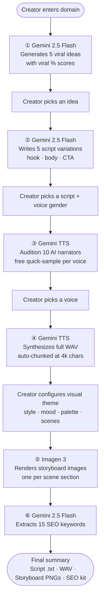

# YouTube Ideation & Script Voice Tool

> End-to-end YouTube content pipeline: enter a niche → get viral ideas → pick a script → audition AI narrators → synthesize WAV audio → generate a visual storyboard → export your full SEO kit. Powered entirely by the Gemini API.

## Pipeline



## Cost Transparency

Every API call that costs money is gated behind a confirmation modal that shows the exact estimate before running. Voice quick-samples are intentionally left ungated (~$0.000006 each — interactive audition UX).

| Step | Model | Typical cost |
|---|---|---|
| Idea generation | Gemini 2.5 Flash | ~$0.0003 |
| Script generation | Gemini 2.5 Flash | ~$0.0009 |
| Full narration (WAV) | Gemini TTS | ~$0.03 per 1k chars |
| Storyboard (3 scenes) | Imagen 3 | $0.12 ($0.04/image) |
| SEO keywords | Gemini 2.5 Flash | ~$0.0001 |

## Features

- **Idea generation** — 5 viral video concepts with estimated view counts and viral potential score
- **Script generation** — 5 full script variations per idea, readable inline
- **Voice audition** — 10 AI narrators (5 male, 5 female) via Gemini TTS; quick-sample any voice before committing
- **Full audio synthesis** — complete script rendered as a downloadable WAV, auto-chunked for long scripts
- **Visual theme designer** — configure style, mood, color palette, aspect ratio, text overlay, and per-scene descriptions
- **Storyboard generation** — Imagen 3 renders one image per scene section; download individual PNGs from the summary
- **SEO kit** — 15 trending keywords extracted for the chosen topic
- **All downloads in one place** — script `.txt`, narration `.wav`, and storyboard `.png` files on the final summary screen

## Stack

| Layer | Technology |
|---|---|
| UI | React 19 + TypeScript |
| Build | Vite 6 |
| Styling | Tailwind CSS (CDN) + Font Awesome 6 Free |
| AI — text & keywords | Gemini 2.5 Flash (structured JSON output) |
| AI — voice synthesis | Gemini 2.5 Flash TTS → raw PCM → Web Audio API WAV |
| AI — image generation | Imagen 3 (`imagen-3.0-generate-001`) |
| Auth | API key via `.env.local` — no backend required |

## Setup

```bash
git clone https://github.com/shaheersalal/Youtube-Ideation-Script-Voice-Tool
cd Youtube-Ideation-Script-Voice-Tool
npm install
cp .env.example .env.local   # add your Gemini API key
npm run dev                  # http://localhost:3000
```

Get a free Gemini API key at [aistudio.google.com](https://aistudio.google.com/apikey).

## Environment

```env
GEMINI_API_KEY=your_key_here
```

The Vite config injects this as `process.env.API_KEY` at build time — no server-side secrets needed.

## Project Structure

```
App.tsx                        — thin orchestrator: hook call + step switch + header/nav
hooks/
  useAppHandlers.ts            — all state, gate pattern, and pipeline handlers
services/
  pipeline.ts                  — barrel export + PipelineStep enum
  costEstimator.ts             — estimateStep(step, input): CostEstimate (exhaustive switch)
  ai/
    client.ts                  — getAI() singleton
    ideas.ts                   — generateIdeas(domain): VideoIdea[]
    scripts.ts                 — generateScripts(idea): ScriptOption[]
    audio.ts                   — generateVoicePreview() + generateFullAudio() (WAV, chunked)
    keywords.ts                — generateKeywords(domain, title): string[]
    images.ts                  — generateSceneImages(scenes, theme): string[] (Imagen 3)
components/
  StepIndicator.tsx            — 8-step progress bar
  PermissionGate.tsx           — cost confirmation modal (shown before every API call)
  VideoThemeForm.tsx           — controlled form for VideoTheme (style/mood/scenes/vision)
  steps/
    DomainInputStep.tsx
    IdeasStep.tsx
    ScriptsStep.tsx
    VoiceSelectionStep.tsx
    FullAudioStep.tsx
    VideoThemeStep.tsx
    VideoGenerationStep.tsx
    FinalSummaryStep.tsx
constants/
  voices.ts                    — MALE_VOICES + FEMALE_VOICES
types.ts                       — Step enum, all domain interfaces, AppState
```
