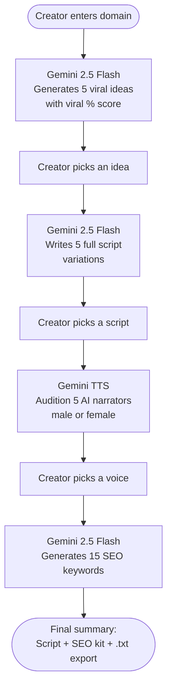

# YouTube Ideation & Script Voice Tool

> End-to-end YouTube content pipeline: enter a niche → get viral ideas → pick a script → audition AI voices → export your SEO kit. Powered entirely by the Gemini API.

## Pipeline



## Features

- **Idea generation** — 5 viral video concepts with estimated view counts and viral potential score
- **Script generation** — 5 full script variations per idea, viewable inline
- **Voice audition** — 10 AI narrators (5 male, 5 female) using Gemini TTS; preview any voice before committing
- **SEO kit** — 15 trending keywords extracted for the chosen topic
- **Script export** — download final script as `.txt` in one click

## Stack

| Layer | Technology |
|---|---|
| UI | React 19 + TypeScript |
| Build | Vite 6 |
| Styling | Tailwind CSS (CDN) + Font Awesome icons |
| AI (text) | Google Gemini 2.5 Flash — structured JSON output |
| AI (voice) | Gemini 2.5 Flash TTS — raw PCM audio streamed to Web Audio API |
| Auth | API key via `.env.local` — no backend required |

## Setup

```bash
git clone https://github.com/shaheersalal/Youtube-Ideation-Script-Voice-Tool
cd Youtube-Ideation-Script-Voice-Tool
npm install
cp .env.example .env.local   # add your Gemini API key
npm run dev                  # http://localhost:3000
```

Get a free Gemini API key at [aistudio.google.com](https://aistudio.google.com/apikey).

## Environment

```bash
GEMINI_API_KEY=your_key_here
```

The Vite config injects this as `process.env.API_KEY` at build time — no server-side secrets.

## Project Structure

```
App.tsx                  — state machine, audio playback, all 5 step views
services/gemini.ts       — 4 Gemini API calls (ideas, scripts, keywords, TTS)
components/
  StepIndicator.tsx      — progress bar across 5 steps
types.ts                 — Step enum, VideoIdea, ScriptOption, VoiceOption, AppState
vite.config.ts           — env injection, port 3000
```
